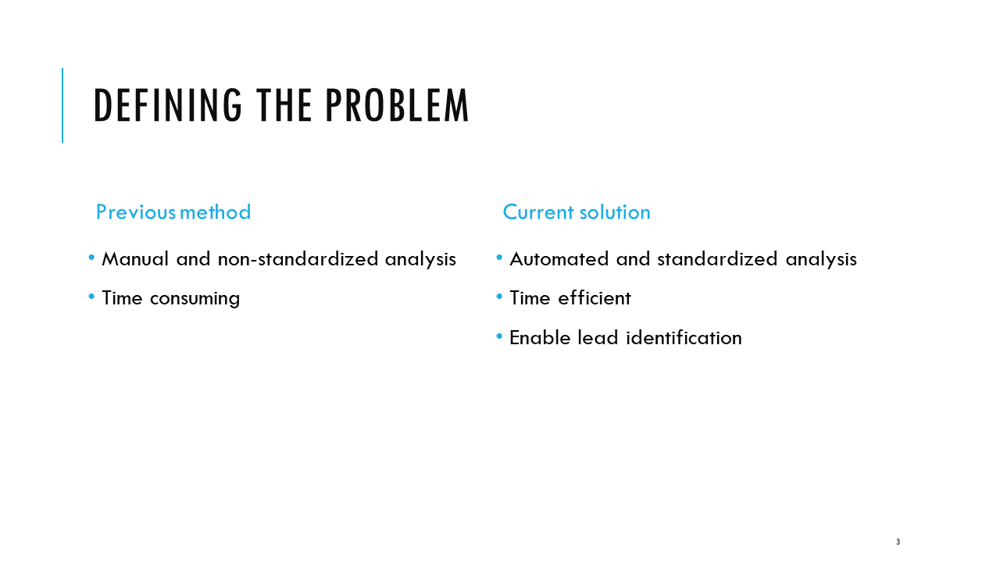
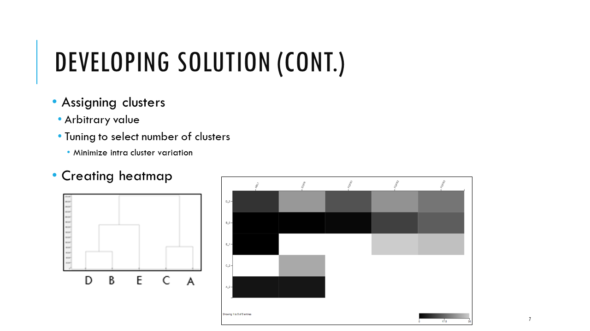
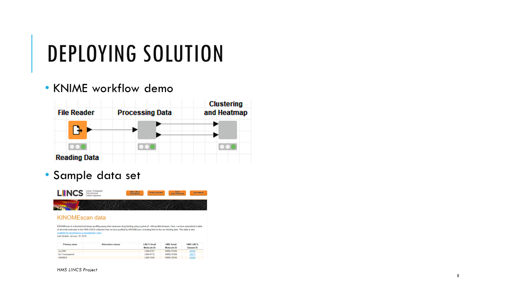
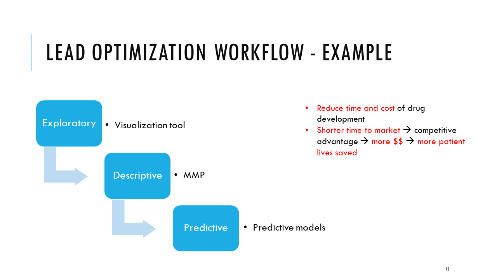

# Objective

To identify potential leads from multi-dimensional data sets in a user-friendly and intuitive way.

# Background

During drug development, compounds are screened against assays to look at how compounds react. Leads are commonly defined as compounds that have selective activity against assays. These compounds can be identified by through hierarchical clustering where compounds with similar activities are grouped into a cluster. 

# Discovering Data

Sample data set can be found in ./data/data.csv. It is obtained from HMS LINCS database, www.lincs.hms.harvard.edu/db

# Developing Solution

# Deploying Solution

KNIME is an open-source data analytics platform that allows users to drag and drop nodes that perform certain functions, https://www.knime.com/. The solution is deployed in KNIME for 2 reasons:

1. Low-cost, scalable, flexible, and quick deployment
	- Changes can be made by modifying a node in the workflow and deploying it on the server instantly
	- This is a priority for the business as the company does not have a dedicated data science and engineering team to manage deployment

2. User-friendly and intuitive interface
	- Users can upload any data and customize analysis through a web interface and visualization is output in an interactive manner that is easy to get insights from

*Workflow can be downloaded from ./solution/viz_hts.kwf but KNIME needs to be installed in order to run the workflow. Results are summarized in the images below*

In the dendrogram, compounds are divided into 6 clusters and assays are divided into 4 clusters. Compounds and assays in the heatmap follow the order of the dendrogram, and the cluster number is assigned after the underscore. In the heatmap, values above 35 are indicated white because compounds do not strongly inhibit kinase function, and are termed inactive. Color ranges from black to light grey, the darker the color, the stronger the compound inhibits kinase function, and are termed more active. Compounds that are active against few kinases are considered more selective (e.g., ZG-10 & QL-XI-92), while those that are active against a lot of kinases (e.g., KIN001-220) are considered less selective. The goal is to identify compounds that are more selective so that we can better design drugs that target specific kinases.

The assignment of clusters do not affect the ordering of the heatmap. The number of clusters selected show the level of separation in the data. If we separate the data into more clusters, we can further see the minute differences among clusters. On the other hand, if we separate the data into fewer clusters, we see higher-level differences. For example, if we separate the compounds into 2 cluster, at the division of KIN001-220, we see 2 distinct activity profiles. Compounds above KIN001-220 (say cluster 1) are more selective while compounds below KIN001-220 (including KIN001-220) (say cluster 2) are less selective. Within each cluster, there are subclusters that show further difference in activity profile. Cluster 1 can be subdivided into 3 clusters where TAK-715 & Barasertib belong to one cluster, CG-930 another cluster, and QL-XI-92 a separate cluster, as they inhibit different kinases.

The tile view shows the raw data and structure of compounds. In the actual implementation, everything is interactive; selection in one view will be reflected in the other view, which is useful to hone in on specific compounds for larger data sets. After we have identified potential leads based on the heatmap, we can move to the tile view to see if there is any correlation betwee the structure of these compounds and their activity to determine if there is a specific chemical group that could result in the effect we want to observe.

# Improving Solution

# Future Work

Future work will involve analyzing the structure and activity of compounds to further understand how structure relate to activity so that we can better design drugs that result in the effect we want to see. The goal is to identify small structural changes that result in the greatest change in activity according to the analysis described below.

After understanding more about the structure and how it relates to activity, we can transition from descriptive to predictive analytics where we predict the activity of new structures. Once we see the desired activity in the new structures, we can then synthesize drugs. This could significantly reduce time and cost in drug development as we design drugs with the notion that they will result in the activity we desire based on data-driven analysis, as opposed to experimenting with a variety of structures and seeing how the activity correlate.

Process of creating a predictive model is shown below:

We can combine our current and future work to design a workflow as shown below:

The goal is to predict the activity of new compounds and specifically develop drugs that have the targeted activity to reduce cost and time associated with drug development.

# Conclusion

